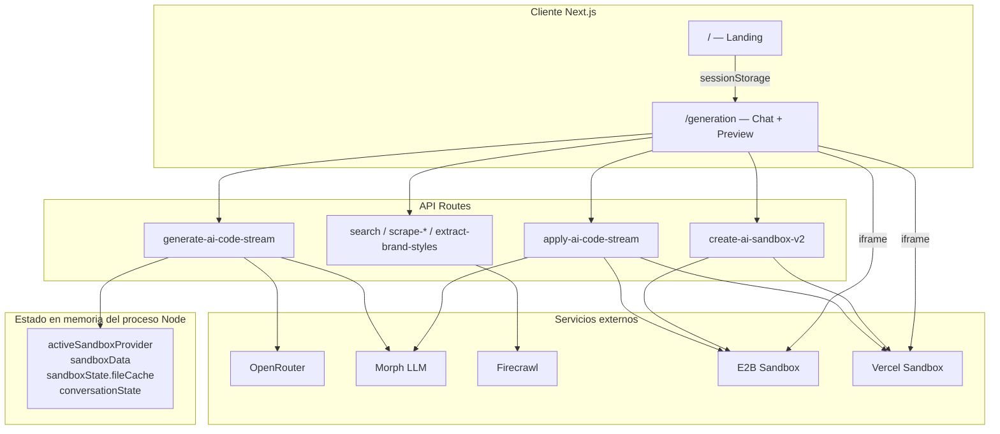
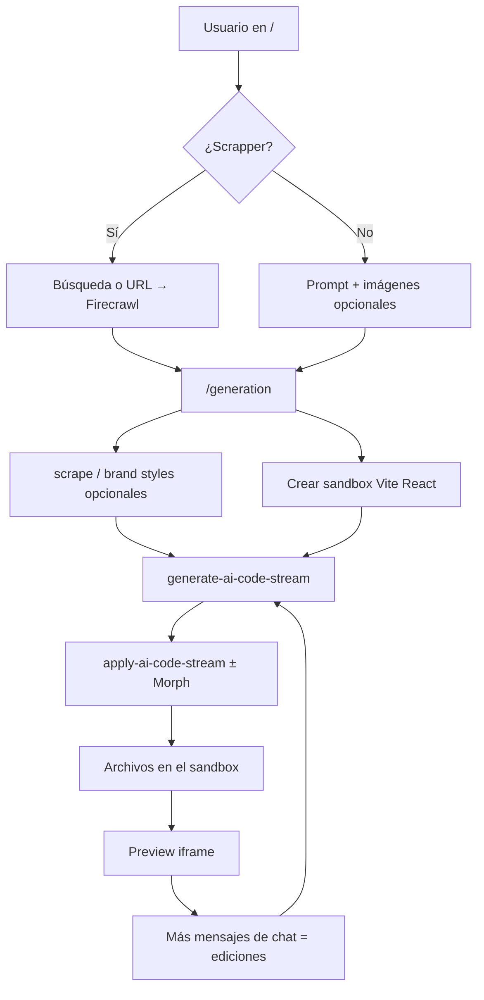
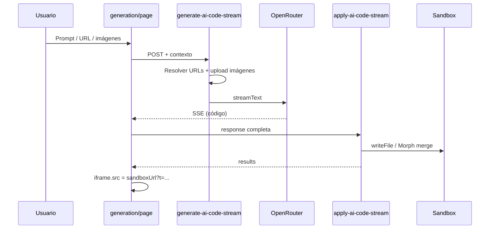
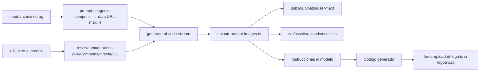

# Documentación del proyecto — mxr-open-lovable

Documentación técnica completa del creador de apps con IA (fork/brand de Open Lovable, UI en castellano / Mixreal).

---

## Índice

1. [Qué es este proyecto](#1-qué-es-este-proyecto)
2. [Arquitectura de alto nivel](#2-arquitectura-de-alto-nivel)
3. [Arranque y configuración](#3-arranque-y-configuración)
4. [Flujo de usuario de extremo a extremo](#4-flujo-de-usuario-de-extremo-a-extremo)
5. [Cómo se genera el código](#5-cómo-se-genera-el-código)
6. [Dónde se guarda el código](#6-dónde-se-guarda-el-código)
7. [Aplicación de cambios (Apply + Morph)](#7-aplicación-de-cambios-apply--morph)
8. [Imágenes: adjuntos, URLs y logos](#8-imágenes-adjuntos-urls-y-logos)
9. [Vista previa (preview)](#9-vista-previa-preview)
10. [Scrapper (Firecrawl)](#10-scrapper-firecrawl)
11. [Sandboxes (E2B y Vercel)](#11-sandboxes-e2b-y-vercel)
12. [Servicios externos y variables de entorno](#12-servicios-externos-y-variables-de-entorno)
13. [Páginas de la app](#13-páginas-de-la-app)
14. [API routes](#14-api-routes)
15. [Módulos `lib/` y tipos](#15-módulos-lib-y-tipos)
16. [Estado global del servidor](#16-estado-global-del-servidor)
17. [Design system y UI](#17-design-system-y-ui)
18. [Limitaciones conocidas](#18-limitaciones-conocidas)
19. [Mapa rápido de archivos](#19-mapa-rápido-de-archivos)

---

## 1. Qué es este proyecto

**mxr-open-lovable** es una aplicación Next.js que permite:

1. Describir una app (o scrapear una web de referencia).
2. Que un modelo de IA genere código **React + Vite + Tailwind**.
3. Ejecutar ese código en un **sandbox remoto** (E2B o Vercel Sandbox).
4. Ver el resultado en un **iframe de preview** e iterar por chat (ediciones, logos, paquetes, etc.).

No es un editor de código local: el proyecto generado vive en la máquina remota del sandbox. Esta app (Next.js) es el **orquestador**: UI, prompts, APIs y conexión con servicios externos.

| Pieza | Tecnología |
|-------|------------|
| Host / UI | Next.js 15 (App Router), React 19, Turbopack |
| Apps generadas | Vite + React + Tailwind (dentro del sandbox) |
| IA | OpenRouter (Vercel AI SDK) |
| Ediciones rápidas | Morph Fast Apply (opcional) |
| Scrape / búsqueda | Firecrawl (UI: “Scrapper”) |
| Runtime de preview | E2B o Vercel Sandbox |

---

## 2. Arquitectura de alto nivel



**Capas:**

1. **UI** (`app/page.tsx`, `app/generation/page.tsx`): captura prompt, imágenes, modelo; muestra chat y preview.
2. **API** (`app/api/**`): orquesta IA, sandbox, scrape y apply.
3. **Sandbox**: filesystem + Vite donde vive la app generada.
4. **Estado servidor**: caché de archivos y conversación en `global` (proceso Node).

---

## 3. Arranque y configuración

### Instalación

```bash
cd mxr-open-lovable
pnpm install   # o npm / yarn
cp .env.example .env.local
# Rellenar claves (ver sección 12)
pnpm dev
```

Abrir [http://localhost:3000](http://localhost:3000).

### Configuración central

| Archivo | Rol |
|---------|-----|
| `.env.local` / `.env.example` | Secretos y provider de sandbox |
| `config/app.config.ts` | Timeouts, puertos Vite, modelos por defecto, delays de refresh |
| `package.json` | Scripts `dev` / `build` / `start` / tests |
| `next.config.ts` | Imágenes remotas, límite body de server actions (8 MB) |

Modelo por defecto: `anthropic/claude-sonnet-4.6` (vía OpenRouter).

---

## 4. Flujo de usuario de extremo a extremo



### Paso a paso

1. **Landing (`/`)**  
   - Modo **prompt**: texto + adjuntos de imagen.  
   - Modo **Scrapper**: URL o búsqueda web (Firecrawl).  
   - Selección de modelo OpenRouter.  
   - Datos pendientes en `sessionStorage` → navegación a `/generation`.

2. **Workspace (`/generation`)**  
   - Crea sandbox si no existe (`POST /api/create-ai-sandbox-v2`).  
   - Lanza generación (`POST /api/generate-ai-code-stream`) con SSE.  
   - Al terminar, aplica código (`POST /api/apply-ai-code-stream`).  
   - Refresca el iframe con la URL pública del sandbox.  
   - El chat posterior marca `isEdit: true` y usa contexto de archivos existentes.

---

## 5. Cómo se genera el código

**Endpoint principal:** `POST /api/generate-ai-code-stream`  
**Archivo:** `app/api/generate-ai-code-stream/route.ts`

### Entrada

JSON típico:

- `prompt` — texto del usuario  
- `model` — slug OpenRouter  
- `isEdit` — si ya hay app aplicada  
- `images` — data URLs `data:image/...` (adjuntos)  
- `context` — `sandboxId`, `currentFiles`, etc.

### Pipeline interno

1. **Imágenes**  
   - Adjuntos + URLs detectadas en el texto (`lib/resolve-image-urls.ts`).  
   - Subida al sandbox (`lib/sandbox/upload-prompt-images.ts`).  
   - Si hay imágenes → **Morph desactivado** (no puede embeber binarios grandes).

2. **Contexto de edición** (si `isEdit`)  
   - Manifest / caché de archivos.  
   - Análisis de intención (`/api/analyze-edit-intent`, `lib/edit-intent-analyzer.ts`).  
   - Búsqueda de archivos relevantes (`lib/file-search-executor.ts`, `lib/context-selector.ts`).  
   - System prompt quirúrgico (solo archivos necesarios).

3. **Llamada al modelo**  
   - Cliente OpenRouter: `lib/ai/provider-manager.ts` (`OPEN_ROUTER_API_KEY`).  
   - Streaming con Vercel AI SDK (`streamText`).  
   - Respuesta en SSE al cliente (thinking, status, chunks de archivos).

4. **Formato que debe producir el modelo**

   - Generación completa / archivos nuevos:
     ```xml
     <file path="src/components/Header.jsx">
     ...código...
     </file>
     ```
   - Ediciones Morph (solo si Morph activo y sin imágenes):
     ```xml
     <edit path="src/components/Header.jsx">
     ...snippet parcial...
     </edit>
     ```

5. **Salida al cliente**  
   - Stream SSE con tipos `status`, `thinking`, `stream`, `complete`, etc.  
   - Metadata: `logoSwap`, `disableMorph`, `uploadedImages`.

### Diagrama de secuencia



---

## 6. Dónde se guarda el código

| Capa | Ubicación | Notas |
|------|-----------|--------|
| **Fuente de verdad** | Filesystem del sandbox remoto | E2B: `/home/user/app` · Vercel: working dir `/app` (ver `config/app.config.ts`) |
| **Provider activo** | `global.activeSandboxProvider` + `sandboxManager` | `lib/sandbox/sandbox-manager.ts` |
| **URL de preview** | `global.sandboxData` + estado React | `{ sandboxId, url }` |
| **Caché de archivos** | `global.sandboxState.fileCache` | `{ files, lastSync, sandboxId, manifest? }` |
| **Paths escritos** | `global.existingFiles: Set<string>` | Tracking de archivos conocidos |
| **Conversación** | `global.conversationState` | Mensajes, edits, evolución del proyecto |
| **Cliente** | React state + `sessionStorage` | Chat y metadatos; **no** el árbol completo del proyecto |

**Importante:** el código generado **no** se persiste en el repo de Next.js ni en una base de datos. Si el sandbox muere o el proceso Node se reinicia, se pierde el estado en memoria (hay que regenerar / recrear sandbox).

### Estructura típica dentro del sandbox

```
public/
  uploads/          ← imágenes del usuario (logo, referencias)
src/
  assets/uploads/   ← módulos JS con data URL de respaldo
  components/
  App.jsx / App.tsx
  ...
index.html
package.json
vite.config.*
```

---

## 7. Aplicación de cambios (Apply + Morph)

**Endpoint principal:** `POST /api/apply-ai-code-stream`  
**Archivo:** `app/api/apply-ai-code-stream/route.ts`

### Qué hace

1. Parsea bloques `<file>` y/o `<edit>` de la respuesta de la IA.  
2. Si Morph está habilitado: fusiona snippets con el archivo actual (`lib/morph-fast-apply.ts`).  
3. Escribe al sandbox vía `provider.writeFile` / `writeBinaryFile`.  
4. Actualiza `fileCache` y `existingFiles`.  
5. Instala paquetes detectados si hace falta.  
6. Puede reiniciar Vite.  
7. Si es cambio de logo con imagen subida: `forceUploadedLogoIntoApp` (`lib/sandbox/force-uploaded-logo.ts`).

### Cuándo se usa Morph

| Condición | Morph |
|-----------|--------|
| `isEdit` + `MORPH_API_KEY` + **sin** imágenes/uploads | Activado (ediciones rápidas) |
| Hay adjuntos o URLs de imagen resueltas | **Desactivado** |
| Generación inicial desde cero | Normalmente archivos completos `<file>` |
| Flag `disableMorph` / assets en `/uploads/` | **Desactivado** |

Morph es un “fast apply” de diffs textuales: útil para cambios pequeños de código, **inútil** para sustituir un logo por un PNG/SVG real.

Hay también `POST /api/apply-ai-code` (legacy, sin stream).

---

## 8. Imágenes: adjuntos, URLs y logos



### Adjuntos (cliente)

- `lib/prompt-images.ts` — compresión a data URL, límite de cantidad.  
- `components/PromptImageAttachments.tsx` — UI.  
- Se envían en el body de generate como `images: string[]`.

### URLs en el texto del prompt

- `lib/resolve-image-urls.ts`:
  - Extrae `https://...` del mensaje.
  - Páginas Wikipedia/Commons (`Archivo:` / `File:`) → API MediaWiki → URL en `upload.wikimedia.org`.
  - URLs directas `.png` / `.svg` / etc.
  - Fallback `og:image` en HTML.
  - Guarda contra descargar HTML disfrazado de imagen (páginas wiki que terminan en `.svg`).
- Se convierten a data URL y se tratan igual que adjuntos.

### En el sandbox

| Destino | Propósito |
|---------|-----------|
| `public/uploads/user-{timestamp}-{n}.{ext}` | Servido por Vite como `/uploads/...` → `` |
| `src/assets/uploads/user-*.js` | `export default "data:image/..."` por si el modelo prefiere import |

Soporta JPEG, PNG, WebP, GIF, **SVG**, AVIF.

### Detección de cambio de logo

`isLogoSwapRequest()` en `lib/prompt-images.ts`:

- Menciona logo/logotipo **y** intención de cambio, **o**
- URL de imagen + “cambia / por esta imagen / logo…”.

Si `logoSwap === true`, el apply puede forzar el logo real en Header/Hero/App para evitar que el modelo “dibuje” tipografía falsa.

---

## 9. Vista previa (preview)

**Dónde:** `app/generation/page.tsx` (tab Preview + iframe).

### Cómo funciona

1. Al crear el sandbox, la API devuelve una **URL pública** (dominio E2B o `sandbox.domain(5173)` en Vercel).  
2. El iframe carga `sandboxData.url`.  
3. Tras aplicar código, se hace cache-bust:  
   `sandboxData.url + '?t=' + Date.now() + '&applied=true'`.  
4. Dentro del sandbox, **Vite HMR** actualiza la app sin cambiar de URL (salvo reloads forzados / restart Vite).  
5. Se puede abrir la URL en pestaña nueva.

### Errores de Vite

- `components/HMRErrorDetector.tsx` intenta leer overlays del iframe (limitado por cross-origin).  
- APIs: `sandbox-logs`, `monitor-vite-logs`, `report-vite-error`, `restart-vite`.  
- Config de delays: `config/app.config.ts` → `codeApplication.*`.

El preview **no** es un build estático servido por Next.js: es el **dev server del sandbox**.

---

## 10. Scrapper (Firecrawl)

En la UI se llama **Scrapper**; por debajo usa **Firecrawl**.

| Endpoint | Uso |
|----------|-----|
| `POST /api/search` | Búsqueda + resultados con markdown/screenshot |
| `POST /api/scrape-url-enhanced` | Scrape enriquecido para alimentar la generación |
| `POST /api/scrape-website` | Scrape genérico (mock si no hay key) |
| `POST /api/scrape-screenshot` | Captura de pantalla |
| `POST /api/extract-brand-styles` | Extracción de branding (colores, tipografías, etc.) |

Variable: `FIRECRAWL_API_KEY`.

El scrape aporta **contexto** al prompt de generación (estructura, estilo, copy), no sustituye al sandbox.

---

## 11. Sandboxes (E2B y Vercel)

### Selección

`SANDBOX_PROVIDER=e2b` | `vercel`  
Factory: `lib/sandbox/factory.ts`  
Creación actual: `POST /api/create-ai-sandbox-v2`.

### E2B

- Paquete: `@e2b/code-interpreter`  
- Provider: `lib/sandbox/providers/e2b-provider.ts`  
- Working dir: `/home/user/app`  
- Vite en puerto **5173**  
- Auth: `E2B_API_KEY`

### Vercel Sandbox

- Paquete: `@vercel/sandbox`  
- Provider: `lib/sandbox/providers/vercel-provider.ts`  
- Auth: `lib/sandbox/vercel-auth.ts`  
  - OIDC: `VERCEL_OIDC_TOKEN` (vía `vercel link` + `vercel env pull`)  
  - o PAT: `VERCEL_TOKEN` + `VERCEL_TEAM_ID` + `VERCEL_PROJECT_ID`  
- Timeout típico: 30 min (`appConfig.vercelSandbox`)

### Ciclo de vida

| Acción | Endpoint |
|--------|----------|
| Crear + setup Vite React | `create-ai-sandbox-v2` |
| Estado | `sandbox-status` |
| Matar / limpiar | `kill-sandbox` |
| Listar archivos | `get-sandbox-files` |
| Comandos | `run-command-v2` |
| Instalar paquetes | `install-packages-v2`, `detect-and-install-packages` |
| Reiniciar Vite | `restart-vite` |
| Export zip | `create-zip` |

Interfaz abstracta: `lib/sandbox/types.ts` (`SandboxProvider`: `writeFile`, `runCommand`, etc.).

---

## 12. Servicios externos y variables de entorno

| Servicio | Para qué | Variables |
|----------|----------|-----------|
| **OpenRouter** | Todos los LLMs | `OPEN_ROUTER_API_KEY` (obligatoria). Opcional: `OPEN_ROUTER_HTTP_REFERER`, `OPEN_ROUTER_APP_TITLE` |
| **Firecrawl** | Scrapper | `FIRECRAWL_API_KEY` |
| **Morph** | Fast apply en ediciones | `MORPH_API_KEY` |
| **E2B** | Sandbox | `SANDBOX_PROVIDER=e2b`, `E2B_API_KEY` |
| **Vercel Sandbox** | Sandbox | `SANDBOX_PROVIDER=vercel` + OIDC o PAT (arriba) |
| **App URL** | Self-calls internos | `NEXT_PUBLIC_APP_URL` (fallback `localhost:3000`) |

Plantilla: `.env.example`.

### Modelos disponibles (OpenRouter)

Definidos en `config/app.config.ts`:

- Claude Sonnet 4.6 / Opus 4.1  
- GPT-4.1 / GPT-4o  
- Gemini 2.5 Pro / Flash  

Lista dinámica: `GET /api/openrouter-models` + `lib/openrouter-models.ts`.

---

## 13. Páginas de la app

| Ruta | Archivo | Rol |
|------|---------|-----|
| `/` | `app/page.tsx` | Landing: prompt, Scrapper, imágenes, modelo → `/generation` |
| `/generation` | `app/generation/page.tsx` | Workspace: chat, generación, apply, archivos, preview |
| `/builder` | `app/builder/page.tsx` | Flujo legado / demo (no path productivo principal) |
| — | `app/landing.tsx` | Variante no montada como route |
| Layout | `app/layout.tsx` | Metadata ES, fuentes, CSS global |

---

## 14. API routes

### Generación y apply

| Método | Ruta | Archivo |
|--------|------|---------|
| POST | `/api/generate-ai-code-stream` | `app/api/generate-ai-code-stream/route.ts` |
| POST | `/api/apply-ai-code-stream` | `app/api/apply-ai-code-stream/route.ts` |
| POST | `/api/apply-ai-code` | `app/api/apply-ai-code/route.ts` (legacy) |
| POST | `/api/analyze-edit-intent` | `app/api/analyze-edit-intent/route.ts` |

### Sandbox

| Método | Ruta | Notas |
|--------|------|-------|
| POST | `/api/create-ai-sandbox-v2` | **Path actual** |
| POST | `/api/create-ai-sandbox` | Legacy |
| GET | `/api/sandbox-status` | |
| POST | `/api/kill-sandbox` | |
| GET | `/api/get-sandbox-files` | |
| POST | `/api/create-zip` | |
| POST | `/api/run-command-v2` | Actual |
| POST | `/api/run-command` | Legacy |
| POST | `/api/install-packages-v2` | Actual |
| POST | `/api/install-packages` | Legacy |
| POST | `/api/detect-and-install-packages` | |
| POST | `/api/restart-vite` | |
| GET | `/api/sandbox-logs` | |
| GET | `/api/monitor-vite-logs` | |

### Vite errors / conversación / modelos

| Método | Ruta |
|--------|------|
| POST | `/api/report-vite-error` |
| GET | `/api/check-vite-errors` |
| POST | `/api/clear-vite-errors-cache` |
| GET/POST/DELETE | `/api/conversation-state` |
| GET | `/api/openrouter-models` |

### Scrape / search

| Método | Ruta |
|--------|------|
| POST | `/api/search` |
| POST | `/api/scrape-url-enhanced` |
| POST | `/api/scrape-website` |
| POST | `/api/scrape-screenshot` |
| POST | `/api/extract-brand-styles` |

---

## 15. Módulos `lib/` y tipos

| Módulo | Rol |
|--------|-----|
| `lib/ai/provider-manager.ts` | Cliente OpenRouter (AI SDK) |
| `lib/morph-fast-apply.ts` | Parse `<edit>`, merge Morph, escritura |
| `lib/context-selector.ts` | Selección de archivos + system prompt de edición |
| `lib/edit-intent-analyzer.ts` | Clasificación de intención (heurísticas) |
| `lib/edit-examples.ts` | Ejemplos de patrones de edición |
| `lib/file-search-executor.ts` | Ejecuta planes de búsqueda sobre el cache |
| `lib/file-parser.ts` | Imports/exports/componentes → manifest |
| `lib/build-validator.ts` | Comprueba que el sandbox sirva la app real |
| `lib/prompt-images.ts` | Adjuntos cliente + `isLogoSwapRequest` |
| `lib/resolve-image-urls.ts` | URLs (Wiki/directas) → data URL |
| `lib/openrouter-models.ts` | Tipos / listado modelos |
| `lib/url.ts` | Detección de URLs |
| `lib/sandbox/factory.ts` | Factory E2B / Vercel |
| `lib/sandbox/sandbox-manager.ts` | Registro, reconexión, cleanup |
| `lib/sandbox/types.ts` | Interfaz `SandboxProvider` |
| `lib/sandbox/providers/e2b-provider.ts` | Implementación E2B |
| `lib/sandbox/providers/vercel-provider.ts` | Implementación Vercel |
| `lib/sandbox/vercel-auth.ts` | OIDC vs PAT |
| `lib/sandbox/upload-prompt-images.ts` | Subida de imágenes al proyecto generado |
| `lib/sandbox/force-uploaded-logo.ts` | Forzar `` de logo tras apply |

**Types:** `types/sandbox.ts`, `types/conversation.ts`, `types/file-manifest.ts`.

---

## 16. Estado global del servidor

Vive en el proceso Node de Next.js (`global.*`). **No es multi-instancia ni serverless-safe** de forma nativa: un sandbox “activo” por proceso.

| Global | Contenido |
|--------|-----------|
| `activeSandboxProvider` | Provider actual |
| `sandboxData` | `{ sandboxId, url }` |
| `sandboxState.fileCache` | Mapa path → contenido + sync |
| `existingFiles` | Set de paths |
| `conversationState` | Historial de chat / edits |
| `viteErrors` / caches relacionados | Errores reportados |

El cliente mantiene espejo parcial en React (chat UI, `sandboxData`, progreso de generación).

---

## 17. Design system y UI

- Tema Mixreal: `styles/mixreal-theme.css`, `styles/design-system/colors.css`, `styles/main.css`, `colors.json`.  
- UI de producto en **castellano** (landing, generation, toasts, toggle Scrapper).  
- Componentes: `components/app/(home)/**`, `components/shared/**`, shadcn en `components/ui/**`.  
- Preview browser chrome: `components/shared/preview/web-browser.tsx`.

---

## 18. Limitaciones conocidas

1. **Estado en memoria:** reiniciar `pnpm dev` o redeploy pierde sandbox/caché/conversación del proceso.  
2. **Dualidad v1/v2:** el path productivo usa `*-v2` y `apply-ai-code-stream`; existen rutas legacy ligadas a `global.activeSandbox`.  
3. **Morph ≠ imágenes:** con logos/adjuntos/URLs de imagen Morph se apaga a propósito.  
4. **URLs de Wikipedia:** hay que resolver la página `Archivo:` al SVG/PNG real; no sirve pegar solo el HTML de la ficha.  
5. **OIDC de Vercel caduca:** si `SANDBOX_PROVIDER=vercel` falla con 403, renovar con `vercel env pull` o usar PAT / E2B.  
6. **`/builder` y `app/landing.tsx`:** residuales respecto a `/` + `/generation`.

---

## 19. Mapa rápido de archivos

```
mxr-open-lovable/
├── app/
│   ├── page.tsx                 # Landing
│   ├── generation/page.tsx      # Workspace + preview
│   ├── layout.tsx
│   └── api/                     # Todas las API routes
├── components/                  # UI (home, shared, preview, adjuntos)
├── config/app.config.ts         # Config de producto
├── lib/
│   ├── ai/                      # OpenRouter
│   ├── sandbox/                 # Providers, uploads, force logo
│   ├── resolve-image-urls.ts
│   ├── prompt-images.ts
│   ├── morph-fast-apply.ts
│   └── ...
├── types/
├── styles/                      # Mixreal / design system
├── docs/ARQUITECTURA.md         # Este documento
├── .env.example
└── packages/create-open-lovable # CLI scaffolding E2B/Vercel
```

---

## Checklist de desarrollo local

- [ ] `.env.local` con `OPEN_ROUTER_API_KEY`
- [ ] Sandbox: E2B **o** Vercel (OIDC/PAT válidos)
- [ ] Opcional: `FIRECRAWL_API_KEY`, `MORPH_API_KEY`
- [ ] `pnpm dev` → `/` → generar → ver iframe en `/generation`
- [ ] Probar edición por chat y cambio de logo (adjunto o URL Wikipedia)

---

*Última actualización: alineada con el flujo productivo `create-ai-sandbox-v2` → `generate-ai-code-stream` → `apply-ai-code-stream`, resolución de URLs de imagen y uploads a `public/uploads/`.*
